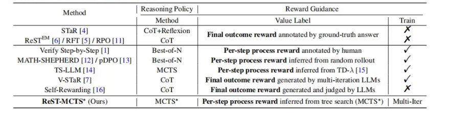

# 周报 - 2024年第46周（11.11-11.17）

| 项目名称                         | 本周任务                                                         | 工作结果 | 导师反馈 | 下周计划                                                                                                             |
| :------------------------------- | :--------------------------------------------------------------- | :------- | :------- | :------------------------------------------------------------------------------------------------------------------- |
|  基于推理轨迹的思维学习和优化   |   文献调研 [1]|  1. 调研与自我反思、从推理轨迹中学习相关的文献，了解最新的工作进展 以及收集可改进的baseline工作 2. 根据开题内容以及文献调研结果  拟定初步的研究流程和框架 |     |1. 学习和运行pDPO的代码 作为 baseline  2. 在1-2个具体数据集上实现初步的基于一致性的轨迹采样方法| 
|  基于元技能组合的混合专家模型|文献调研[1] |   1. 调研元技能划分和挖掘相关文献 2. 思考元技能粒度的设置和自动学习方法 |  发现现有的元技能学习相关的研究 主要在机器人的技能分解与组合 以及 Agent相关的研究上  或者停留在prompt的层次上 与本研究设想的元技能差别较大 暂时未找到可参考的信息        |          | 继续进行调研  主要关注推理领域有无相关性更强的研究
|  |                                                          |        |          | 

### 主要的调研文献列表：
- 推理轨迹相关
[1] Jiao, F., Qin, C., Liu, Z., Chen, N.F. and Joty, S., 2024. Learning planning-based reasoning by trajectories collection and process reward synthesizing. arXiv preprint arXiv:2402.00658.
[2] ReST-MCTS∗: LLM Self-Training via Process Reward Guided Tree Search
[3] Math-Shepherd: Verify and Reinforce LLMs Step-by-step without Human Annotations
[4] Stream of Search (SoS): Learning to Search in Language
[5] Star: Bootstrapping reasoning with reasoning.
[6] V-star: Training verifiers for self-taught reasoners
[7] Zheng Yuan, Hongyi Yuan, Chengpeng Li, Guanting Dong, Chuanqi Tan, and Chang Zhou. Scaling relationship on learning mathematical reasoning with large language models. arXiv preprint arXiv:2308.01825, 2023.
[8] Avi Singh, John D Co-Reyes, Rishabh Agarwal, Ankesh Anand, Piyush Patil, Peter J Liu, James Harrison, Jaehoon Lee, Kelvin Xu, Aaron Parisi, et al. Beyond human data: Scaling self-training for problem-solving with language models. arXiv preprint arXiv:2312.06585, 2023.
[9] Buffer of thoughts: Thought-augmented reasoning with large language models

- 元技能相关
[1] OpenMoE: An Early Effort on Open Mixture-of-Experts Language Models
[2] Bootstrap Your Own Skills: Learning to Solve New Tasks with Large Language Model Guidance
[3] M. Shridhar, J. Thomason, D. Gordon, Y. Bisk, W. Han, R. Mottaghi, L. Zettlemoyer, and D. Fox. ALFRED: A Benchmark for Interpreting Grounded Instructions for Everyday Tasks. In Computer Vision and Pattern Recognition, 2020
[5] Meta-Prompting:  Enhancing Language Models with Task-Agnostic Scaffolding
[6] Meta Reasoning for Large Language Models
[7] Mars: A benchmark for multi-llm algorithmic routing system
[8] Mr-gsm8k: A meta-reasoning revolution in large language model evaluation
